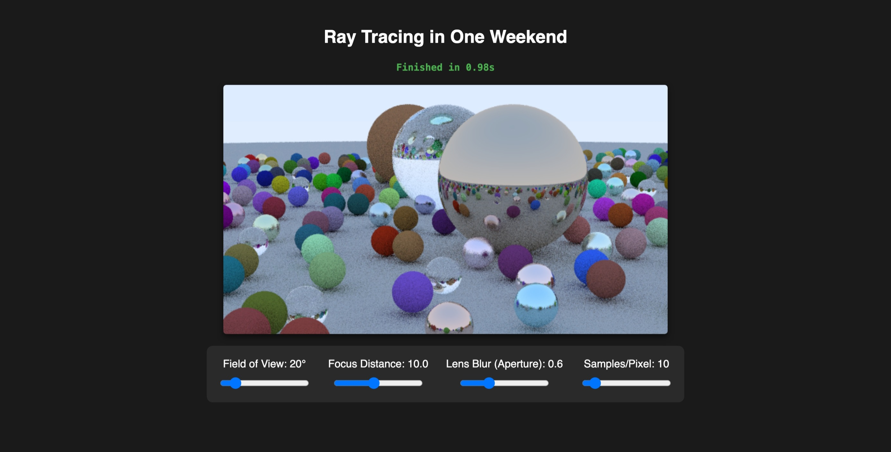
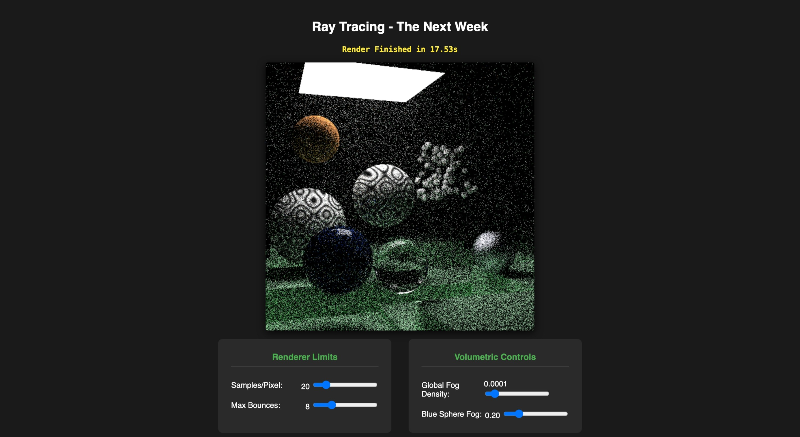
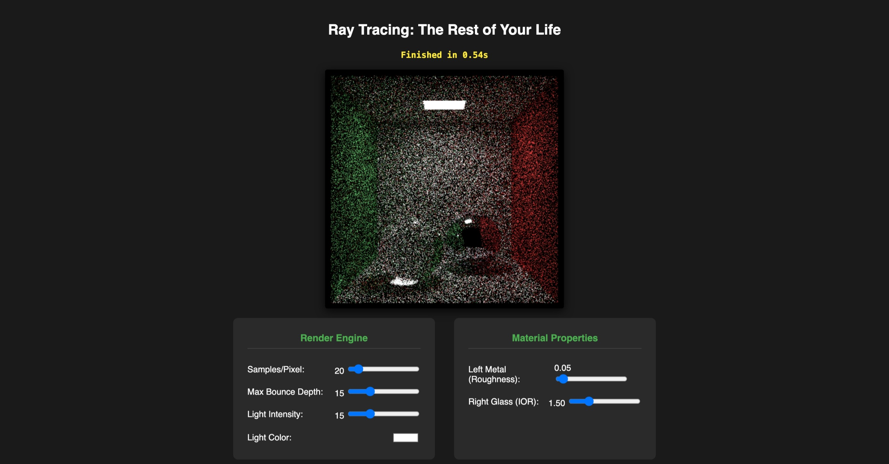

# Ray Tracing In One Weekend (Interactive)
HTML5 based version
Original Repo: https://raytracing.github.io/

The interactive browser-based demos I built serve as a bridge between the raw C++ code of the book and visual intuition. While the book is brilliant, traditional ray tracing is famously slow; changing a single variable like "camera field of view" or "metal fuzziness" typically requires recompiling the code and waiting minutes or hours for a new image to render.

By porting the core C++ math into JavaScript and leveraging Web Workers for parallel CPU rendering, the demos achieved three main goals:

- Instant Visual Feedback: Sliders allow you to adjust mathematical properties—like a dielectric material's Index of Refraction (IOR), a camera's focal blur, or a light's intensity—and immediately see how those numbers alter the physical simulation of light.

- Demystifying Monte Carlo Integration: By letting you control the "Samples Per Pixel" and "Max Bounces," the demos visually demonstrate the core engine of path tracing. You can physically watch how throwing random rays (Monte Carlo simulation) converges from a noisy, static-filled image into a smooth, photorealistic render.

- Accessibility: They remove the barrier to entry. Instead of needing to install CMake, a C++ compiler, and an IDE to see the book's final results, anyone with a standard web browser can experiment with the physics of light directly on the page.

## Screenshots

## Reference

[_Ray Tracing in One Weekend_](https://raytracing.github.io/books/RayTracingInOneWeekend.html)
